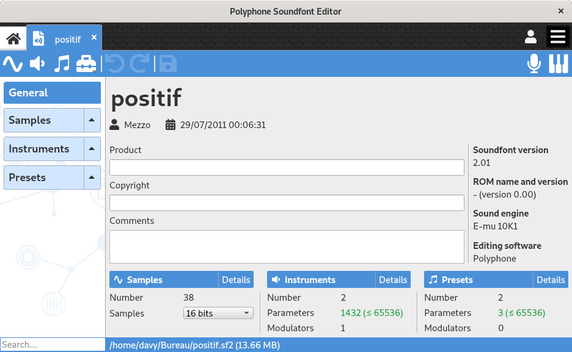

The page for editing the general information is displayed when the header :guilabel:`General` is selected in the [tree](manual/soundfont-editor/tree.md).
This page is made of three kinds of elements:

* [editable fields](#doc_edit),
* [general information](#doc_info) that are not editable,
* [statistics](#doc_stats) about the soundfont.

## Editable fields {#doc_edit}

The editing page of the general information provides fields for changing the following attributes:

* **Title**\
  This is the internal name of the soundfont, which does not necessarily have to do with the file name.
* **Author**\
  Relates to the author name of the soundfont.
* **Date**\
  Creation date of the file.
* **Product**\
  Product for which is designed the soundfont.
* **Copyright**\
  Mention to fill if the file is subject to copyright.
* **Comments**\
  Information not included in any of the preceding categories.
* **Kind of samples**\
  Indicates whether the samples should be recorded in 16 bits or 24 bits.
  Please note that 24-bit samples may not be supported in some synthesizers.

## General information {#doc_info}

The editing page of the general information comprises the following non-editable information:

* **Soundfont version**\
  Corresponds the version of the [sf2 format](manual/annexes/the-different-soundfont-formats.md#doc_sf2) used by the file.
* **ROM name and version**\
  Name and version of a sample ROM if used.
* **Sound engine**\
  Corresponds to the name of a sound engine.
* **Editing software**\
  Editing software used for the soundfont creation.
* **File name**\
  Address and name of the file.
* **File size**\
  Size of the soundfont after it is saved.

## Statistics {#doc_stats}

A count is made on:

* the number of [samples](manual/soundfont-editor/editing-pages/sample-editor.md) and unused samples,
* the number of [instruments](manual/soundfont-editor/editing-pages/instrument-editor.md) and unused instruments,
* the number of [presets](manual/soundfont-editor/editing-pages/preset-editor.md),
* the number of parameters and modulators edited for the instruments,
* the number of parameters and modulators edited for the presets.

Unused samples and instruments can be easily removed with the tool “[Remove unused elements](manual/soundfont-editor/tools/global-tools.md#doc_unused)”.

**Note:** The number of 65536 parameters in the instruments and the presets should not be exceeded.
Some synthesizers may not be adapted to read them all.