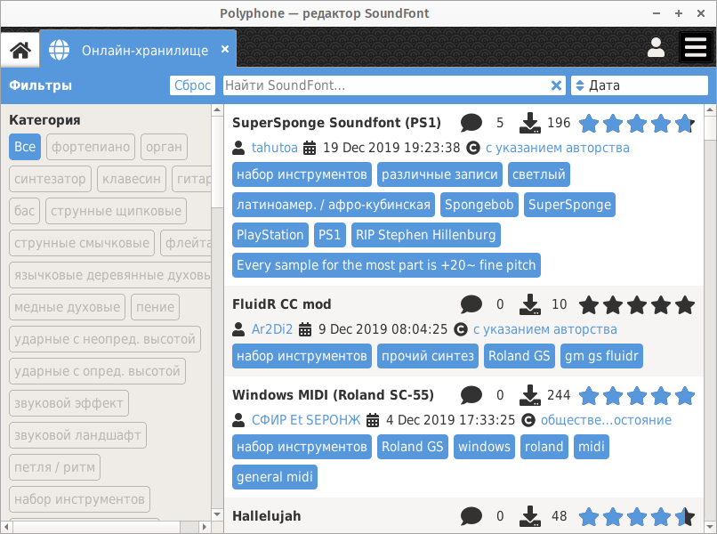
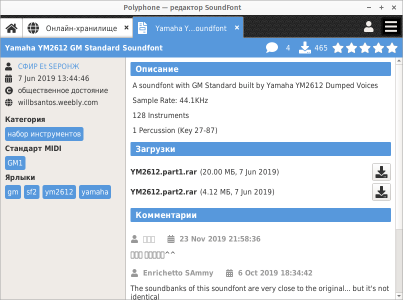
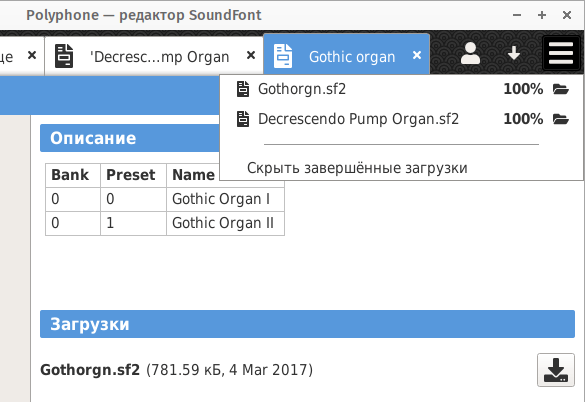

Браузер SoundFont является связующим звеном между Polyphone и хранилищем SoundFont на сайте Polyphone.
Он позволяет вам непосредственно в Polyphone загружать, тестировать и, при необходимости, повторно использовать файлы SoundFont.

## Обзор SoundFont {#doc_browse}

Чтобы открыть браузер SoundFont, щёлкните по кнопке :guilabel:`Онлайн-хранилище` или введите ключевое слово на [главном экране](manual/index.md).
Как только браузер SoundFont откроется в новой вкладке, можно искать, сортировать и фильтровать результаты.

### Поиск SoundFont

Для поиска SoundFont введите одно или несколько ключевых слов в верхней панели и нажмите клавишу :kbd:`Ввод`.
Можно написать :command:`Author:*такой-то*` для поиска SoundFont указанного автора.

### Сортировка результатов

Рядом с панелью поиска, выпадающее меню предоставляет 4 способа сортировки результатов поиска Soundfont:

* **Дата**\
  Самые новые SoundFont в начале.
* **Загрузки**\
  Больше всего загружаемые SoundFont в начале.
* **Рейтинг**\
  Лучшие по рейтингу SoundFont в начале.
* **Заголовок (A→Z)**\
  Результаты поиска SoundFont сортируются в алфавитном порядке.

### Фильтрация результатов

Результаты могут быть отфильтрованы разными способами:

* **Категория**\
  Вид инструмента.
* **Лицензия**\
  Можно перечислить SoundFont, имеющие лицензию, разрешающую коммерческое использование и распространение отредактированного SoundFont.
* **Источник образца**\
  Происхождение семплов.
* **Тембр**\
  Описание тембра.
* **Артикуляция**\
  Описание артикуляции.
* **Жанр**\
  Жанр, на который ориентирован SoundFont.
* **Стандарт MIDI**\
  Можно перечислить только те SoundFont, которые соответствуют стандарту.
* **Метки**\
  Показать SoundFont, имеющие определённую метку.

## Описание SoundFont {#doc_description}

Чтобы открыть описание SoundFont, нужно выполнить двойной щелчок по ячейке в :guilabel:`Ежедневных SoundFont` на [главном экране](manual/index.md#doc_right) или в [браузере SoundFont](#doc_browse).
Чтобы открыть SoundFont не из :guilabel:`Ежедневных SoundFont`, требуется учётная запись Премиум.
Подключение Polyphone к вашей учётной записи производится в [настройках](manual/settings.md#doc_repository) программы.

Описание SoundFont состоит из:

* **заголовка**, в котором вы можете найти название, количество комментариев, загрузок и рейтинг,
* **левой части**, включающей имя автора, дату, тип лицензии (пожалуйста, не забывайте о ней), категорию и другие атрибуты, которые характеризуют SoundFont,
* **центральной части**, отображающей текстовое описание, список файлов для загрузки и комментарии, если они имеются.

## Загрузка {#doc_download}

Для загрузки файла нажмите на значок :guilabel:`Загрузка` рядом с его именем в разделе :guilabel:`Загрузки`.
Вы увидите прогресс загрузки в меню рядом с главным меню, в верхнем правом углу программы.
Как только файл будет загружен, и если он является SoundFont, его можно открыть в [редакторе SoundFont](manual/soundfont-editor/index.md), щелкнув значок :guilabel:`Открыть`.

Из этого меню можно убрать завершённые загрузки.
Когда всё убрано, меню загрузки исчезает.

